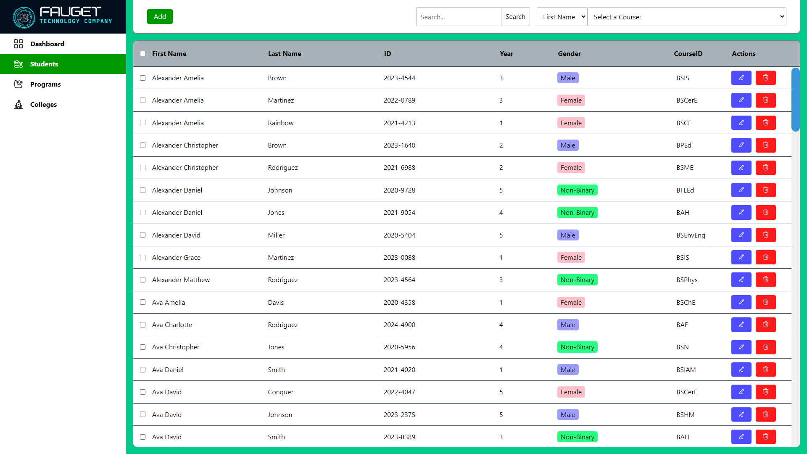

# Student Information Management System 🖥️🖨️🛜


## 📖 Introduction

Welcome to the **Student Information Management System**! This web application is built using Flask, a lightweight web framework for Python, and MySQL as the database. The application allows a manager to perform various operations related to student records, including:

- **Create** new student entries
- **Read** and view existing student information
- **Update** student details
- **Delete** student records
- **List** all students

This app is ideal for managing student data, including their name, school ID, year, gender, and course.

## ✨ Features

- **CRUDL Operations**: Create, Read, Update, Delete, and List student information.
- **User-Friendly Interface**: Easy-to-navigate web interface for managing student data.
- **Secure Database Management**: MySQL is used for reliable and secure data storage.

## 🤖 Technologies Used

- **Flask**: A micro web framework for Python to build the application.
- **MySQL**: Database used to store student information.
- **HTML/CSS/JavaScript**: Front-end technologies for building the user interface.

## 🤔 Prerequisites

Before you begin, ensure you have met the following requirements:

- Python 3.x installed on your machine.
- MySQL server installed and running.
- Basic understanding of Flask and MySQL.

## 💿 Installation

1. **Clone the repository**:
    ```bash
    git clone https://github.com/yourusername/student-info-management-system.git
    cd student-info-management-system
    ```

2. **Install the required Python packages**:
    ```bash
    pipenv install -r requirements.txt
    ```

3. **Configure the database**:
   - Create a MySQL database named `enrolledstudents`.
   - Update the `config.py` file with your MySQL credentials.
   - Run the following command to initialize the database:
        - Enter MySQL Terminal
        ```bash
        mysql -u root -p
        ```
        - Inside MySQL Terminal
        ```sql
        CREATE DATABASE enrolledstudents;
        EXIT;
        ```
        - Back to Bash Terminal
        ```bash
        mysql -u root -p enrolledstudents < initSQLData.sql
        ```

4. **Run the Flask application**:
    ```bash
    flask run --debug
    ```
    ⚠️ Use this command below if it doesn't work ⚠️
    ```bash
    pipenv run flask --app run.py run --debug
    ```

5. **Access the application**:
   Open your web browser and navigate to `http://127.0.0.1:5000`.

## ⚠️ Usage

- **Adding a Student**: Use the "Add Student" feature to input new student details into the database.
- **Viewing Student Details**: The "Student List" page displays all the students. Click on any student to view more details.
- **Updating Student Information**: Select a student from the list and use the "Edit" option to update their details.
- **Deleting a Student**: Choose a student from the list and use the "Delete" option to remove their record from the database.

---

Developed by [Chriscent Pingol](https://github.com/KishonShrill).
